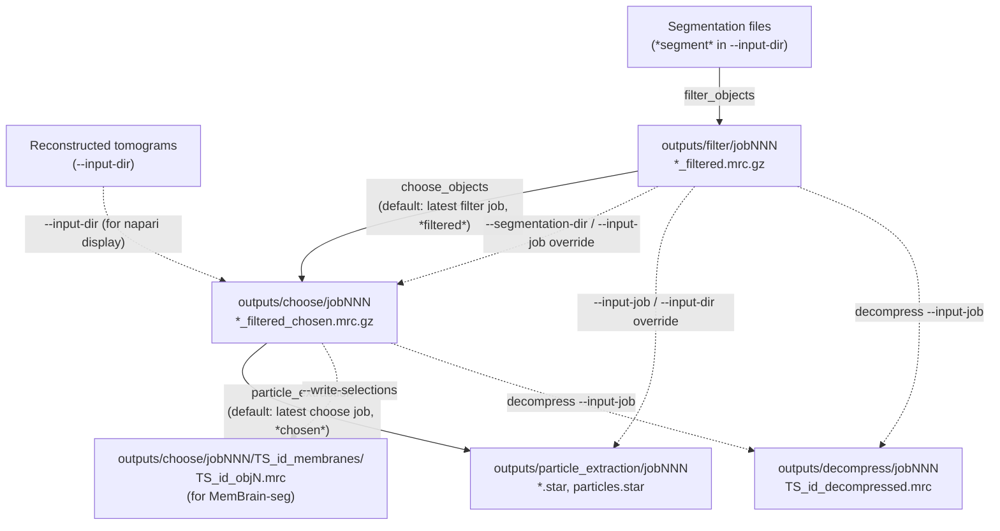

# The PickMe Pipeline

This is the conceptual guide to how a segmentation turns into a `particles.star`
file, and how PickMe decides — often without being told explicitly — which
files feed into which stage. For install instructions and a quick tour, see
[`../README.md`](../README.md). For exact flags, defaults, and per-command
detail, see [`cli-reference.md`](cli-reference.md).

The short version: PickMe is four stages chained by convention. Each stage
writes its output into a numbered job directory, and the next stage, unless
told otherwise, automatically picks up the *latest* job directory belonging
to the stage before it. That auto-chaining is convenient once you understand
it and confusing until you do — this document exists to make it unconfusing.

## Output root and job numbering

Every subcommand writes into an **output root**, which defaults to
`./outputs` relative to wherever you ran `PickMe` from. Passing `--output-dir`
to any subcommand overrides this root for that run — it does not append a
subfolder, it *replaces* `./outputs` entirely with the path you give.

Under the output root, each stage gets its own named subfolder — and the
subfolder name does **not** always match the subcommand name:

| Subcommand | Job directory |
|---|---|
| `filter_objects` | `outputs/filter/` |
| `choose_objects` | `outputs/choose/` |
| `particle_extraction` | `outputs/particle_extraction/` |
| `decompress` | `outputs/decompress/` |
| `convert` | `outputs/convert/` |

Inside each of those, individual runs get `jobNNN` folders, zero-padded to
three digits (`job001`, `job002`, ...).

**The job counter is shared across the whole output root, not per stage.**
Every time any subcommand needs a new job number, PickMe scans *every*
`jobNNN` folder anywhere under the output root — across all five stages —
and picks `max(all existing numbers) + 1`. So if you've run `filter_objects`
three times (`filter/job001`, `job002`, `job003`) and then run
`choose_objects` for the first time, you get `choose/job004`, not
`choose/job001`. Job numbers tell you *when* something ran relative to
everything else in that output root, not how many times a particular stage
has run.

This matters because `--input-job 4` is unambiguous — it always means "the
folder named `job004`, wherever it is under the output root" — but it also
means job numbers jump around between stage folders in a way that can look
like gaps or mistakes if you're not expecting it.

## How each stage finds its input



Solid arrows are the default, unattended path if you supply no override
flags. Dashed arrows are things you opt into with a flag.

**`choose_objects`** finds its segmentation input in this order:
1. `--segmentation-dir <dir>` if given.
2. else `--input-job N` if given (any stage's job folder, matched by number).
3. else the **latest** `outputs/filter/jobNNN`, restricted to files whose
   name contains `filtered`.

Separately, `--input-dir` for this subcommand is always the *tomogram*
directory (the raw/reconstructed volumes), used for display in napari — it
is not part of this resolution chain.

**`particle_extraction`** finds its segmentation input in this order:
1. `--input-job N` if given — this wins even over `--input-dir` if you pass
   both.
2. else, if `--input-dir` is *not* given and at least one `choose_objects`
   job exists, the **latest** `outputs/choose/jobNNN`, restricted to files
   whose name contains `chosen`.
3. else, if `--input-dir` is *not* given and no `choose_objects` job exists
   yet, PickMe raises an error rather than guessing.
4. else, `--input-dir <dir>` if given — every `.mrc`/`.mrc.gz`/`.mrc.bz2`
   file in it, no filename filtering.

**`decompress`** finds its input in this order:
1. `--input-job N` if given — wins over `--input-dir` if both are given.
2. else `--input-dir <dir>` if given.
3. neither given → error.

**`filter_objects`** and **`convert`** don't chain off a previous stage —
they always read straight from whatever `--input-dir` you point them at.

## When to use `--input-job` vs `--input-dir`

Reach for **`--input-job N`** when you want a specific, reproducible run from
earlier in the pipeline — for example, re-running `particle_extraction` at a
different `--sample-rate` against the exact same `choose_objects` output you
used last time, even if you've run `choose_objects` again since then and the
"latest" job has moved on. It's the precise, "pin this to job004" option, and
it always overrides `--input-dir` when both are present.

Reach for **`--input-dir <dir>`** when your input didn't come from a PickMe
job at all — segmentations from an external tool, a hand-curated directory,
or the very first `filter_objects` call where there's no earlier stage to
point at.

Leaving both off relies on the default "latest job of the previous stage"
lookup described above. That's the convenient path for a straight-through
run, but it's also the one most likely to silently pick up the wrong data if
you've been experimenting — if in doubt, pass `--input-job` explicitly.

## The zyx / XYZ convention

Segmentation arrays throughout PickMe are indexed in **zyx** order — that's
just how `mrcfile` hands back numpy arrays, and it's the order used
internally for coordinates, object masks, and marching-cubes output. When
those coordinates are finally written into a STAR file, the columns are
`rlnCoordinateX`, `rlnCoordinateY`, `rlnCoordinateZ` — ordinary **XYZ**, as
RELION expects. If you ever read PickMe's source or write your own script
against its internals, keep this axis flip in mind; it's a common source of
"my particles are picked in the wrong place" bugs if you assume XYZ ordering
too early.

Angles follow the same downstream convention: `rlnAngleRot`, `rlnAngleTilt`,
`rlnAnglePsi` are ZYZ Euler angles in RELION's convention, written in
**degrees**, derived from each sampled point's surface normal (`tilt` and
`psi` from the normal's geometry; `rot` is drawn at random per particle,
since there's no meaningful azimuthal reference around a membrane normal).
The full column set written to each STAR file is `rlnCoordinateX/Y/Z`,
`rlnOriginX/Y/Z` (always zero), `rlnAngleRot`, `rlnAngleTilt`,
`rlnAnglePsi`, `rlnMicrographName`, `rlnObject` (the source label number),
`rlnNormalX/Y/Z` (the surface normal itself), and `rlnImagePixelSize`
(Ångströms/pixel, from the segmentation's MRC header) — see
[`cli-reference.md`](cli-reference.md#particle_extraction) for the full
breakdown.

Tomogram IDs are parsed from filenames by splitting on underscores — a file
named `TS_1007_filtered.mrc.gz` yields the ID `1007`, and downstream files
and `.tomostar` names are built back up from that ID (e.g.
`TS_1007.tomostar`). Keep your filenames underscore-delimited with the ID as
the second field, or this parsing will pick up the wrong token.

## Worked walkthrough: segmentations to `particles.star`

Starting point: a directory `./segmentations/` full of membrane segmentation
volumes named like `TS_1007_segment.mrc`, and a directory `./tomograms/`
with the matching reconstructed tomograms `TS_1007.mrc`.

**1. Extract and filter objects.**
```bash
PickMe filter_objects --input-dir ./segmentations
```
Answer `n` at the tomogram-selection prompt to process everything. This
writes `outputs/filter/job001/TS_1007_filtered.mrc.gz` and a knee-detection
plot per tomogram.

**2. Choose objects.**
```bash
PickMe choose_objects --input-dir ./tomograms
```
With no `--segmentation-dir` or `--input-job`, this automatically picks up
`outputs/filter/job001`. Answer `y` at the object-selection prompt to open
napari, use the Regionprops table to select the membranes you want per
tomogram, then close the viewer. This writes
`outputs/choose/job002/TS_1007_filtered_chosen.mrc.gz`.

(If you'd rather skip picking and keep everything from step 1, answer `n`
instead — the files are left as-is, or written out individually if you also
pass `--write-selections`.)

**3. Extract particles.**
```bash
PickMe particle_extraction --sample-rate 15 --cmm
```
With no `--input-dir` or `--input-job`, this automatically picks up the
latest `choose_objects` job (`job002`). It Gaussian-smooths each chosen
object, runs marching cubes, samples the surface at 15-pixel spacing,
computes Euler angles, and writes:
- `outputs/particle_extraction/job003/TS_1007.star`
- `outputs/particle_extraction/job003/particles.star` (all tomograms combined)
- `outputs/particle_extraction/job003/AnglePlots/TS_1007.png`
- `outputs/particle_extraction/job003/TS_1007.cmm` (because `--cmm` was passed)

`particles.star` is the file you hand off to downstream particle-processing
software (e.g. RELION/M).

## Branching off the pipeline

**Exporting individual membranes for MemBrain-seg.** If you want to feed
specific membranes back into MemBrain-seg for retraining rather than
continuing to `particle_extraction`, use `--write-selections` on
`choose_objects`:
```bash
PickMe choose_objects --input-dir ./tomograms --write-selections
```
This writes each selected object as its own uncompressed file,
`outputs/choose/jobNNN/TS_<id>_membranes/TS_<id>_obj<label>.mrc`, with voxels
set to `1` rather than the object's label — a clean binary mask per
membrane, which is the input shape MemBrain-seg training expects. You can
combine this with answering `n` at the object-selection prompt to export
*every* filtered object without hand-picking any of them.

**Viewing intermediate results in ChimeraX.** Every compressed stage output
(`.mrc.gz` from `filter_objects` or `choose_objects`) is opaque to
Chimera/ChimeraX. Use `decompress` to get a plain `.mrc` you can open
directly:
```bash
PickMe decompress --input-job 2
```
This pulls every `.mrc*` file out of `job002` (whichever stage that job
belongs to), asks whether you want all of them or a subset, and writes
`TS_<id>_decompressed.mrc` files you can drag straight into ChimeraX. This is
a read-only side branch — it doesn't feed back into the rest of the
pipeline.
